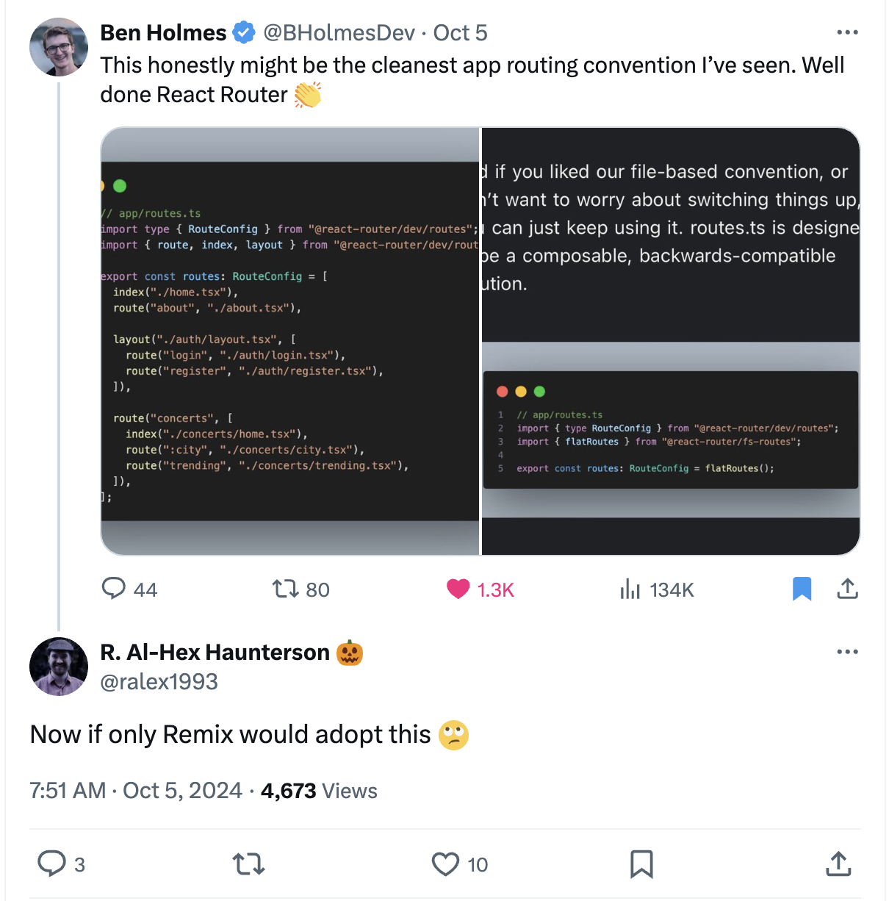

# React Router's `routes.ts` but it's in Remix

People really like [React Router's new `routes.ts`](https://reactrouter.com/dev/guides/start/routing).

[](https://x.com/ralex1993/status/1842548087249932788)

With two little libraries, this is trivial

```sh
npm install -D remix-json-routes @react-router/dev
```

Checkout [vite.config.ts](vite.config.ts). It's basically this:

```ts
import { vitePlugin as remix } from "@remix-run/dev";
import { defineConfig } from "vite";
import { jsonRoutes } from "remix-json-routes";
import { route, layout } from "@react-router/dev/routes";

export default defineConfig({
  plugins: [
    remix({
      ignoredRouteFiles: ["**/*"],
      routes(defineRoutes) {
        return jsonRoutes(defineRoutes, [
          layout("layouts/marketing.tsx", [
            route("/", "routes/home.tsx"),
            route("/about", "routes/about.tsx"),
          ]),
          route("/app", "routes/app.tsx"),
        ]);
      },
    }),
  ],
});
```
